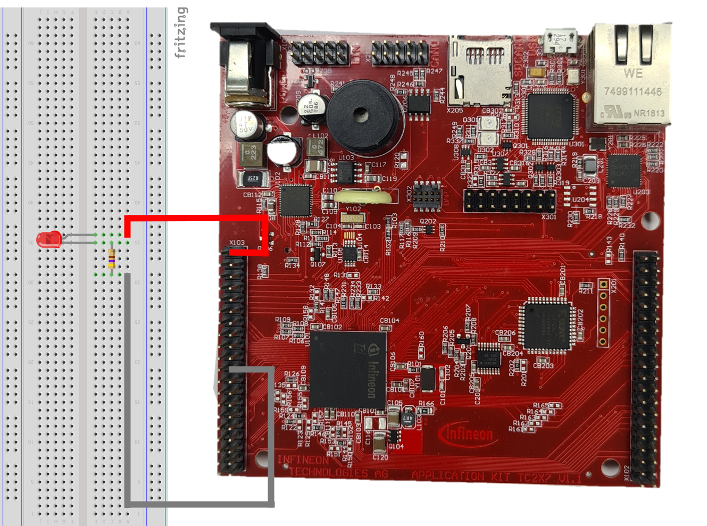

# AURIX TFT TC297B Blinky LED
by Elton Junior

 

When one starts working in the embedded area the microcontroller is one of the most important parts of the development. As a part of my final paper for my master's degree, I'm going to use the kit AURIX TFT TC297 as an ECM (Electronic Control Model). The idea is to use the 
[project](http://fatecsantoandre.edu.br/arquivos/TCC467.pdf) that I made in my graduation, but instead of a PIC microcontroller am going to use the AURIX TC297.

No matter what area is intended to work on, in my humble viewpoint, the HELLO_WORLD shall be done. And you going to ask me:"Why a blink LED is important and what is the relationship with a final paper?"
And I'm going to say. Yes! it is so important as a Timer Interrupt and I will explain why.

If it talks about LED, there is a lot of information when working on it like spectrum, brightness, current, voltage, and class, yes, I said class.
When I start to work as an intern I had no idea about it I thought that only turning on with a resistor is enough, but the LED has specification important in the project though, But unfortunately, this paper will not talk about LED properties and for more information about, go [OSRAM](https://www.osram.com/os/ecat/com/en/class_pim_web_catalog_103489/global/prd_pim_device_2190618/#)
and look how much information it has.

Back to the project, When working with microcontroller pins, we should take care of some points like
- voltage supply;
- current drain;
- pull-up/down. 

## TC297 characteristics
Also what that pin has the functions. In this Blinky_LED example was choice the PIN G2

It is located at Port 00 is a 16-bit bi-directional general-purpose I/O port that can be alternatively used
for GTM, CCU6, Ethernet, MSC, QSPI, MultiCAN+, MultiCANr, PSI5, PSI5-S, SENT,
DSADC, VADC, SCU, CIF, ASCLIN and GPT12 input and output functions[1]. 

Additionally, the TC297 datasheet has the following characteristics:
- The voltage pin range is -0.5 ~ 7.0 V;
- The current pin range per pin Input current on any pin during -10 ~ 10 mA;
- Input maximum sum of all input circuit currents during range -100 ~ 100 mA.

Is there a lot of sites that explain how to polarize a LED, so I won't go through this explanation and I list below some that explain it:
- [Interfacing LED with 8051](https://www.electronicshub.org/led-interfacing-8051/);
- [Microcontroller Interfacing –  Part 4 Driving LED and Other Simple Loads](https://www.w9xt.com/page_microdesign_pt4_drive_led.html);
- [7.2 Connecting LED diodes to PIC microcontroller](http://newengineeringpractice.blogspot.com/2012/01/72-connecting-led-diodes-to-pic.html) .

As I mention in the TC297 characteristics and based on the [Ohm's law](https://en.wikipedia.org/wiki/Ohm's_law) the resistor's value used in this example is 470 [ohms].

 

And finally, the assembly using the KIT is

 

The great news here was the Infineon AURIX IDE that provides the all configuration for the project. The only thing that will need is to start a new project, gave a name to it, and *voilà*!!.

When creating a project in the AURIX IDE it already generates the microcontroller base configuration as a Clock configuration also the IDE included all iLLD(Infineon Low-Level Driver). I remember when I start working with a PIC where I needed to create all LLD to use it. It took me a lot of time reading the datasheet and writing the codes, but CAUTION!!! it doesn't mean that it's not necessary to read the Datasheet. The knowledge about the product that working on is so important too.

## The Code

Talking about code, for this project, was created 2 new files apart from files were created by the IDE.

In the **pin_manager.c** and **pin_manager.h** have a function that will configure the PIN. Another point of this KIT is the support that Infineon provides. In its Github page has all explanations about all functions that the TC297 has. This project was based on the [Blinky_LED_1_KIT_TC297_TFT](https://github.com/Infineon/AURIX_code_examples/blob/master/code_examples/Blinky_LED_1_KIT_TC297_TFT/Cpu0_Main.c).

```c
#define LED_D00     &MODULE_P00,0   
```
In the iLLD, at IfxPort_reg.h is found the address definition of the port choice to connect the LED, so it defined a new name to it. 

```c
void PIN_MANAGER_Initialize(void)
{
    /* Initialization of the LED used in this example */
    IfxPort_setPinModeOutput(LED_D00, IfxPort_OutputMode_pushPull, IfxPort_OutputIdx_general);

    /* Switch OFF the LED (low-level active) */
    IfxPort_setPinHigh(LED_D00);
}  
```

At IfxPort.h has all functions associated it the pin configuration, so, it was used the ``IfxPort_setPinModeOutput``, this function will configure the port as an output with a pull-push operation. The ``IfxPort_setPinHigh`` will set the pin output as a high.

To Blinky the LED it was used the following code

```c
    PIN_MANAGER_Initialize();

    while(1)
    {
        IfxPort_togglePin(LED_D00);                                                /*! Toggle the state of the LED      */
        waitTime(IfxStm_getTicksFromMilliseconds(BSP_DEFAULT_TIMER, WAIT_TIME));    /*! Wait 500 milliseconds            */
    } 
```
The ``PIN_MANAGER_Initialize`` was created to initialize the pin choice and the ``IfxPort_togglePin`` that is the function that comes from iDDL will toggle the LED in the ``waitTime`` as a delay the running of code for 500 ms. This wait is based on System Timer (STM) and uses the TIM0 (Timer0) I will bring more information about TIMER in further projects.

When it was compiled the code the LED connected to P00.0 will start blinky.

 

## Conclusion

In this paper was described a simple Blinky_LED. My idea is to get as much information about the TC297 as possible, I've used my own know-how with other microcontrollers that I've already worked on like Texas TMS320F28377S, PIC18F4550, and ATMEGA2560 and in my view, all microcontroller has the same behavior, so based on this argument I started to create this and the further projects. 

## Reference

[1] - https://www.infineon.com/dgdl/Infineon-TC29x_B-step-UM-v01_03-EN.pdf?fileId=5546d46269bda8df0169ca1bdee424a2

