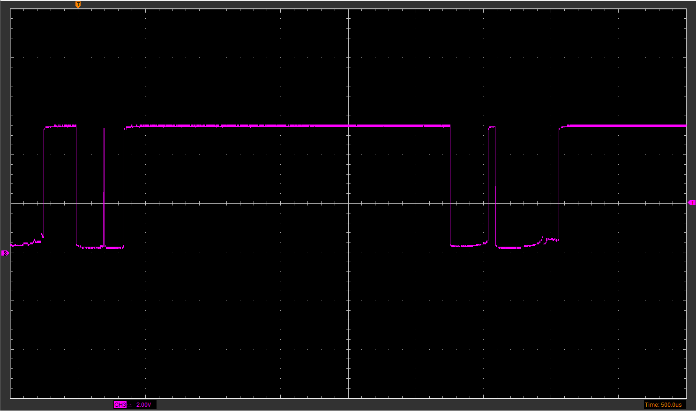
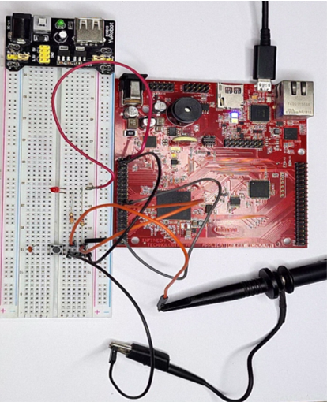

# AURIX TFT TC297B Button

by Elton Junior


One of the interfaces with the microcontroller and the external world is a button. The use of a button means "Hey if you push me I will do something!". This paper will describe the interface from AURIX_TFT_TC297B and a button and when it is pushed the LED connects to AURIX_TFT_TC297B will be turned ON. This paper is a continuing of [03_AURIX_TFT_TC297B_Blinky_LED](https://github.com/EltonJunior/AURIX_TFT_TC297B/tree/main/03_AURIX_TFT_TC297B_Blinky_LED).

When working with Buttons, some characteristics must be taken into account, and how to connect the button to the microcontroller is one of them. The pin has a behavior called Tri-State, this behavior occurs because of its construction, as it is a TTL ( Transistor–transistor logic ) construction. The Tri-State is a range from 0v to 5v and its behavior occurs at 2.5V where this voltage can cause wrong logics states. This means that the GPIOs lines can effectively assume three values:

- logical 0;
- logical 1;
- High-impedance.

The voltage floating is not a good thing when its pin working as an Input. Bellow, I listed some fonts about Tri-State.

- [Three-state logic - Wikipedia](https://www.google.com/url?sa=t&rct=j&q=&esrc=s&source=web&cd=&cad=rja&uact=8&ved=2ahUKEwjl4dKkq-z1AhVPH7kGHXkqDdgQFnoECAQQAQ&url=https%3A%2F%2Fen.wikipedia.org%2Fwiki%2FThree-state_logic&usg=AOvVaw1hIYL-edoHFb9Ypg1evB_2)
- [Digital Buffer Tutorial](https://www.electronics-tutorials.ws/logic/logic_9.html)
- [What is tristate pin?](https://moviecultists.com/what-is-tristate-pin)

For guaranteeing the correct voltage input is used the circuit likes pull-up and pull-down. There are basic 2 ways pull-up and pull-down,

- The pull-up configuration is when the pin is connected pin to Vcc and when the button is pushed the pin goes to GND;
- The pull-down configuration is when the pin is connected pin to GND and when the button is pushed the pin goes to VCC.
  for more detail find this post:
- [Push button interfacing with PIC Microcontroller](https://openlabpro.com/guide/push-button-interfacing-with-pic-microcontroller/);
- [3 Different Ways of Connecting a Push Button to Arduino](https://www.hackster.io/najad/3-different-ways-of-connecting-a-push-button-to-arduino-24771a)
- [Microcontroller Digital Input Basics](https://www.w9xt.com/page_microdesign_pt5_input_basics.html)

## Button Bounce

A bounce is a noise caused by the button mechanism. There are 2 ways to avoid the button bounce, with a Software filter and a circuit filter.

- The Software filter is implemented by using a Counter Timer when the microcontroller has the trigger in the pin it starts a Counter Timer and after a stable time, the real value is assumed.
- The Circuit filter is composted with a capacitor connected parallel with the button.

## The project

This project uses the [03_AURIX_TFT_TC297B_Blinky_LED](https://github.com/EltonJunior/AURIX_TFT_TC297B/tree/main/03_AURIX_TFT_TC297B_Blinky_LED) as base project. Its have a button connected to the PIN_00,0, when the button is pushed the LED will turn ON, and when the button is released the LED turns OFF.


The code is:

```c
  /* Read pin state If the button was pressed */
  if(IfxPort_getPinState(BUTTON) == 0)
  {
    /* put the pin to low */
    IfxPort_setPinState(LED_D00, IfxPort_State_low);
  }
  else
  {
    /* put the pin to high */
    IfxPort_setPinState(LED_D00, IfxPort_State_high);
  }
```

With the routine getPinState() the value of a particular pin can be retrieved. This function can be used to retrieve any port state by just specifying the port number as illustrated as well as the routine setPinState() the state of the port can be set to drive either LOW or HIGH. This function can be used to retrieve any port state by just specifying the port number as illustrated.

## Analysis

### With Debounce

<table>
  <tr>
    
  </tr>
  <tr>
    <td> 500us </td>
    <td> 200ms</td>
  </tr>
</table>

The button signal was instrumented to the microcontroller and it is possible to see in the image that the acquisition made with 500us, it is possible to check the debounce, but when we increase the scale, the debounce is imperceptible due to the oscilloscope sampling rate. since the AURIX_TFT_TC297B has a processing speed of 300Mhz, this noise can cause erroneous readings.  
It was instrumented.

### Without Debounce

<table>
  <tr>
    
  </tr>
  <tr>
    <td> 500us </td>
    <td> 200ms s</td>
  </tr>
</table>

On the other hand, when using a low pass filter, the noise does not appear, ensuring a perfect signal at the input of the pin.

## Conclusion

In this article I tried to show that a simple button has several smaller ones that must be taken into account in the implementation, it is possible to find several solutions in the community on how to turn on a button. Remembering that the project shown here was the connection of a button, it is possible to use the same concept for communication between microcontrollers or drives as I will demonstrate in future projects.

## Reference

[1] - https://www.infineon.com/dgdl/Infineon-TC29x_B-step-UM-v01_03-EN.pdf?fileId=5546d46269bda8df0169ca1bdee424a2
