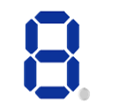

# AURIX_TFT_TC297B 7 SEG Display

by Elton Junior

## Introduction

There is a lot of interfaces that can be used as HMI (Human Machine Interface), when I started learning embedded system my first interface was with a Seven Segment Display. At that time, Display LCD 16x2 was expensive and was not easier to find anywhere as it can be to find today.

To use the code that I did in the [03_AURIX_TFT_TC297B_Blinky_LED](https://github.com/EltonJunior/AURIX_TFT_TC297B/tree/main/03_AURIX_TFT_TC297B_Blinky_LED) where Its connect the LED in the Output pin from AURIX_TFT_297B and the [04_AURIX_TFT_TC297B_Button](https://github.com/EltonJunior/AURIX_TFT_TC297B/tree/main/04_AURIX_TFT_TC297B_Button) where was connect a button to an Input pin, In this paper, a project with a Seven Segment Display will be used and it will run as an Increase Counter. This Counter is a basic incremental counter that can be Starting, Stopping, and Resetting the counter.

## Seven Segment Display

The seven-segment display is composed of 8 LEDs, which are ordered in a clockwise direction named a, b, c, d, e, f, g, and decimal point p, as it showed in the figure.

The electrical characteristics are exactly the same as the LED. In addition, there is a COM pin.

The next figure shows the internal structure of the seven-segment display, which can be divided into two types: one is the common anode (common anode).

- The anode of each segment of LED is connected to each other;
  The other is the common cathode (common anode).
  cathode, abbreviated as (CC) seven-segment display.
- The cathodes of each segment of LED are connected to each other.

#### Driving a common anode seven-segment display

The method of driving a common anode seven-segment display is to connect the COM pin to the +5V power supply, and connect each segment to a 560Ω, For this project, The current limiting resistor to the ground will illuminate.

As shown in Table below, the common anode seven-segment display number from 0 to 9, if microcontroller's port bits from 7 to 0 are connected to p, g, f, e, d, c, b, a and other pins in sequence, then the hexadecimal display code is displayed in sequence are 0xc0, 0xf9, 0xa4, 0xb0, 0x99, 0x92, 0x82, 0xf8, 0x80, 0x90.

<table>
  <tr>
    <td>DIG</td><td>p</td><td>g</td><td>f</td><td>e</td><td>d</td><td>c</td><td>b</td><td>a</td><td>DIG</td><td>p</td><td>g</td><td>f</td><td>e</td><td>d</td><td>c</td><td>b</td><td>a</td>
  </tr>
  <tr>
    <td></td>
    <td>1</td><td>1</td><td>0</td><td>0</td><td>0</td><td>0</td><td>0</td><td>0</td>
    <td></td>
    <td>1</td><td>0</td><td>0</td><td>1</td><td>0</td><td>0</td><td>1</td><td>0</td>
  </tr>
    <tr>
    <td></td>
    <td>1</td><td>1</td><td>1</td><td>1</td><td>1</td><td>0</td><td>0</td><td>1</td>
    <td></td>
    <td>1</td><td>0</td><td>0</td><td>0</td><td>0</td><td>0</td><td>1</td><td>0</td>
  </tr>
    </tr>
    <tr>
    <td></td>
    <td>1</td><td>0</td><td>1</td><td>0</td><td>0</td><td>1</td><td>0</td><td>0</td>
    <td></td>
    <td>1</td><td>1</td><td>1</td><td>1</td><td>1</td><td>0</td><td>0</td><td>0</td>
  </tr>
  </tr>
    </tr>
    <tr>
    <td></td>
    <td>1</td><td>0</td><td>1</td><td>1</td><td>0</td><td>0</td><td>0</td><td>0</td>
    <td></td>
    <td>1</td><td>0</td><td>0</td><td>0</td><td>0</td><td>0</td><td>0</td><td>0</td>
  </tr>
    </tr>
    </tr>
    <tr>
    <td></td>
    <td>1</td><td>0</td><td>0</td><td>1</td><td>1</td><td>0</td><td>0</td><td>1</td>
    <td></td>
    <td>1</td><td>0</td><td>0</td><td>1</td><td>0</td><td>0</td><td>0</td><td>0</td>
  </tr>
</table>

#### Driving a common cathode seven-segment display

The method of driving the common cathode seven-segment display is to ground the COM pin, and connect each segment to a 560Ω,for this project, current limiting resistor.

The table below shows the common cathode seven-segment display number from 0 to 9 font code, if the microcontroller port bits from 7 to 0 are connected to p, g, f, e, d, c, b, a and other pins in sequence, then the hexadecimal display code is 0x3f,0x06, 0x5b, 0x4f, 0x66, 0x6d, 0x7d, 0x07, 0x7f, 0x6f.

<table>
  <tr>
    <td>DIG</td><td>p</td><td>g</td><td>f</td><td>e</td><td>d</td><td>c</td><td>b</td><td>a</td><td>DIG</td><td>p</td><td>g</td><td>f</td><td>e</td><td>d</td><td>c</td><td>b</td><td>a</td>
  </tr>
  <tr>
    <td></td>
    <td>0</td><td>0</td><td>1</td><td>1</td><td>1</td><td>1</td><td>1</td><td>1</td>
    <td></td>
    <td>0</td><td>1</td><td>1</td><td>0</td><td>1</td><td>1</td><td>0</td><td>1</td>
  </tr>
    <tr>
    <td></td>
    <td>0</td><td>0</td><td>0</td><td>0</td><td>0</td><td>1</td><td>1</td><td>0</td>
    <td></td>
    <td>0</td><td>1</td><td>1</td><td>1</td><td>1</td><td>1</td><td>0</td><td>1</td>
  </tr>
    </tr>
    <tr>
    <td></td>
    <td>0</td><td>1</td><td>0</td><td>1</td><td>1</td><td>0</td><td>1</td><td>1</td>
    <td></td>
    <td>0</td><td>0</td><td>0</td><td>0</td><td>0</td><td>1</td><td>1</td><td>1</td>
  </tr>
  </tr>
    </tr>
    <tr>
    <td></td>
    <td>0</td><td>1</td><td>0</td><td>0</td><td>1</td><td>1</td><td>1</td><td>1</td>
    <td></td>
    <td>0</td><td>1</td><td>1</td><td>1</td><td>1</td><td>1</td><td>1</td><td>1</td>
  </tr>
    </tr>
    </tr>
    <tr>
    <td></td>
    <td>0</td><td>1</td><td>1</td><td>0</td><td>0</td><td>1</td><td>1</td><td>0</td>
    <td></td>
    <td>0</td><td>1</td><td>1</td><td>0</td><td>1</td><td>1</td><td>1</td><td>1</td>
  </tr>
</table>

## About this Project

Sometimes, in order to reduce the complexity of circuit board wiring, it is common to pack four seven-segment displays as shown in Figure below, so this project is going to use one like this, and connect the pins of the same name of each segment together, and each seven-segment display has a drive pin.

If it is a common cathode four-connected seven-segment display, each segment is connected to a 560Ω current limiting resistor to microcontroller pin, and any of DIG1, DIG2, DIG3, and DIG4 is grounded in the microcontroller, and the relative digits will light up.

The project proposed here is shown in the Figure below.

## The Program

As I have written before, this project is using the projects that I made before. In the project [04_AURIX_TFT_TC297B_Button](https://github.com/EltonJunior/AURIX_TFT_TC297B/tree/main/04_AURIX_TFT_TC297B_Button) I told about filters when using a button and I only implemented a hardware filter, in this project, it will have continuing but there is a Software's filter as well. When the button is pushed the first timer is decremented, until the button is holding, after elapse the first 10 interactions will invert the variable playPause. If the button continues to hold until elapses 900 interactions it will reset the counter, flowchart below shows how its works.

#### The Button verify

[](https://mermaid-js.github.io/mermaid-live-editor/edit#pako:eNqNlF1vgjAUhv9K1wvjkpnQ4i5GsiWiLtmNM8riFspFlaokWgyUC4P89x0-5EPR2Jt-nPe89DyljfHKdwU28Cbghy2yRkwOBl17bg1mlvPc630wiaAN7KWSI7H0I7kS6B1pDoIYyoOZgKSKzx3fTHf8OOVR2C6jqWwmQqFGXngAaatKt9fgVMg2pYTJXGPG5o9lfU-SciEzgFZ5nP5EeEJDLW5sHJxQp4Oa7rCYoLJVFkMtsy2cSHxd4DmzysnySCNPIxfwSFEwhGgbNeJc76XuO_FTW0LsQy3pqZxk5hCnNmo7NIjot88Kov1L-MQ5c65RKbZBH-JLkotKaJ0Q1e6gvYJAs--XqZdw37QzXXqLbrthXg5Qdb0NAR10NO_0vOtXkOhNuPQuXNoGt4i82ivwUiLI5A3itHbuer3eXs9pXIHa75-KzccupfnQpTRbLmX6cSYXXXv8-wXPRTox9SxvwWT6e1dj0i_HtLYOdZfjMhO_4L0I9txz4WGK0y0wrLZiLxg2YOiKNY92imEmE5BGB5crMXY95QfYWPNdKF4wj5Q_P8oVNlQQibNo5HF45_aFKvkHEVRnLA)

#### The Counter

Below has the flowchart of counter, in it interaction the counter will increment and when the value was great than 100 it will increment the first digit. When the first digit was great than 9 the second digit is going to increment. the third and fourth digit has the same behavior.

## Conclusion

Well done! This paper present a Seven Segment Display, with this project is possible to present a value that is wanted, there are other types of the display much better than Seven Segment, but depending on the budget that the product has and the information be displayed this display is enough e cheaper.

