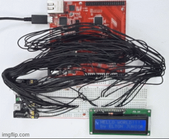
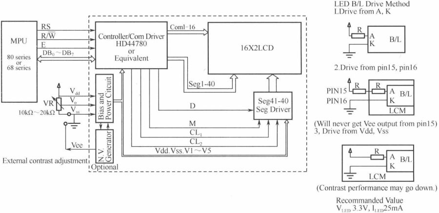
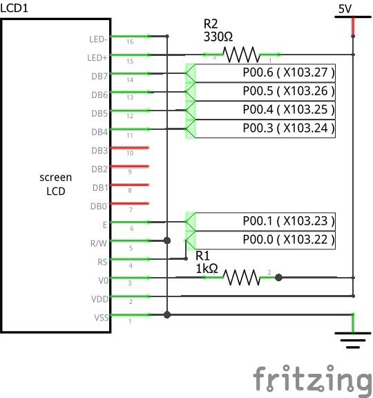
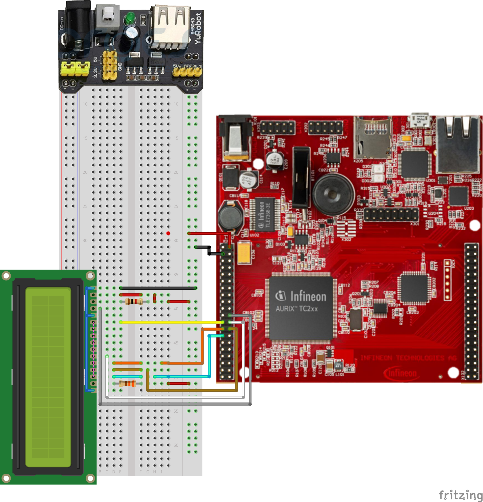

# AURIX_TFT_TC297B LCD Display 16x2

by Elton Junior

## Introduction

This project was built based on Hitachi Display with HD44780 controller. This Display is the most common found on the market. The library used was built to be used with Microchip's C18 compiler, adapted by my friend/teacher/advisor Weslley Torres to be used in his discipline advanced topics in programming at Fatec Santo André and modified by min to be compiled in the AURIX IDE.

LCD 1602 is a dot matrix LCD module specially used to display letters, numbers, symbols, etc. And it has the ability to display 32 characters at the same time. (16 columns and 2 rows).

It has multiple 5X7 or 5X11 dot matrix character bits, each dot matrix character bit can display one character, there is a dot gap between each bit, and there is also a gap between each line, which plays the role of spacing of characters.

The 1602 means that the displayed content is 16X2, that is, it can display two lines, each line has 16 characters (displays characters and numbers and special characters).

As I said, most LCDs on the market are based on the HD44780 LCD chip, and the control principles are exactly the same. Therefore, the control program written based on the HD44780 can be easily applied to most character LCDs on the market.

HD44780 has built-in DDRAM, CGROM, CGRAM. To display information on the LCD display, it is necessary to write the data to the corresponding DDRAM address.

Figure 1 - internal diagram 

LCD 1602 mainly includes 2 working modes, 8-bit mode, and 4-bit mode. 8-bit mode is the mode where an 8-way connection with the microcontroller is used, this mode is most commonly used, with a simple design and convenient operation, a disadvantage of this model is the number of pins that are used, while the 8-bit mode is 4 bits are used only 4 pins of the microcontroller making it a little more complicated because I need to move the data when sending to the microcontroller.

This project will use the 4-bit configuration, and to contain greater pin savings, the LCD will only work as a slave, where the write pin is grounded. Figure 2 shows the connection to AURIX_TFT_TC297B.

Figure 2 - electrical schematic diagram of the assembly

When we use 4 bits, the assembly becomes simpler, but we have a greater effort in the construction of the Software, but we have a community that is always providing a new version of the Software, so it is possible to choose what best suits the project to be applied. For this and other projects, both the library and the way to use the display are enough. Figure 3 shows the final assembly of the display on the board.

Figure 3 - AURIX assembly

## Conclusion

So, This comes to an end with another project using the microcontroller kit AURIX_TFT_TC297B, this project compared to [05_AURIX_TFT_TC297B_SEG_Display](https://github.com/EltonJunior/AURIX_TFT_TC297B/tree/main/05_AURIX_TFT_TC297B_SEG_Display) is better, because now it is possible to show more than 4 digits in addition to writing, and another point is less amount of pins. Another advantage is that the display has its processing and this enables better integration. This project will help to visualize what happens with the variables, not that it is no longer possible to check in debug mode, but the display will make it easier.

## Reference

[1] - https://www.alldatasheet.com/datasheet-pdf/pdf/63673/HITACHI/HD44780.html

